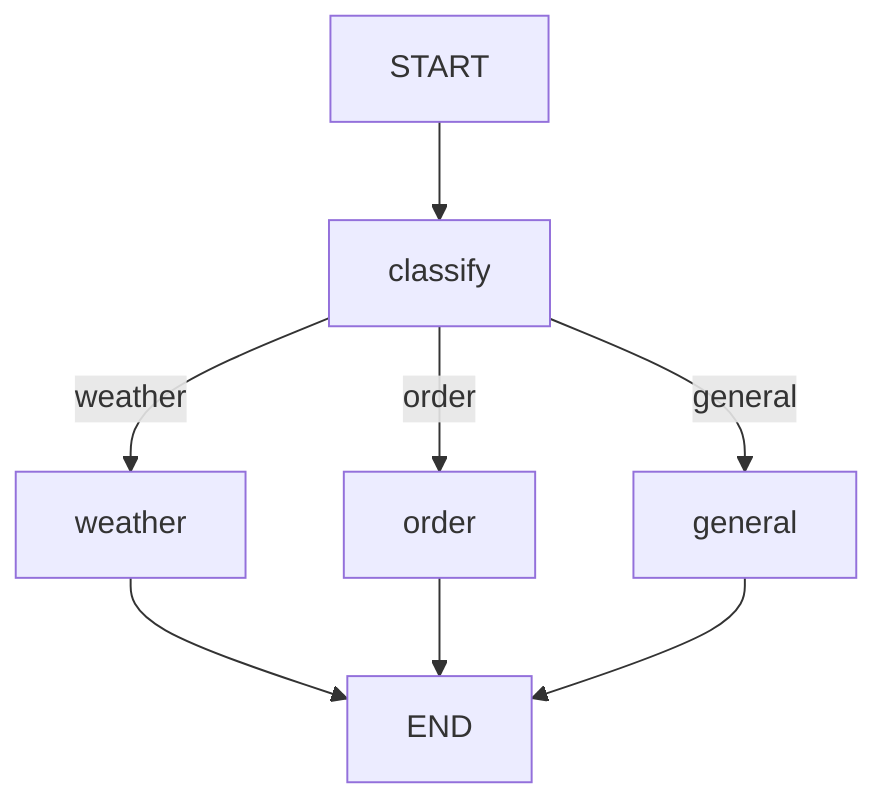

# L2-06 · StateGraph:把 Agent 拆成可编排的图

> LangGraph 是 LangChain 团队的"状态图 + 多 Agent 编排"框架。`StateGraph` 把 Agent 拆成节点 + 边,支持条件路由、并行、动态扇出、子图嵌入——这是 LangChain 1.x 写复杂 Agent 的底层工具。`create_agent` 内部也是一张 StateGraph。

## 为什么学这个

`create_agent(model, tools)` 适合 80% 场景,但遇到这些需求就不够:

- 多步流水线(分析 → 执行 → 总结)
- 条件路由(订单问题走售后,产品问题走售前)
- 并行(技术 / 市场 / 用户多视角并行调研)
- 循环(Agent 多轮 tool calling)
- 子图套娃(技术问题派给"analyze → lookup → solve"子图)

LangGraph 用图论的思想组织 Agent,跟 Spring State Machine / Airflow DAG 是同一类工具,只不过节点函数返回的是"partial state"。

学完这篇,你就能:

- 读懂 `create_agent` 内部到底在跑什么
- 自己搭多节点流水线
- 做并行 / 动态扇出 / 子图嵌入

## 学完你能回答 10 个问题

1. StateGraph 最少要几步?(定义 State → 节点 → 边 → compile → invoke)
2. `MessagesState` 内置了什么?为啥用它最省事?
3. 多节点 pipeline 怎么搭?
4. 条件边 `add_conditional_edges` 怎么用?
5. 循环边怎么让 Agent 跑 tool calling 循环?
6. 怎么把多个节点并行起来?(START → [A, B, C] → join)
7. `Send` 怎么动态扇出?
8. reducer (`add_messages` / `operator.add`) 怎么改 state 合并策略?
9. 怎么把图可视化?(`get_graph().draw_mermaid`)
10. subgraph 怎么把另一个图作为节点嵌入?

## 1. 最简 StateGraph

```python
from langgraph.graph import StateGraph, START, END
from typing_extensions import TypedDict
from typing import Annotated
from langgraph.graph.message import add_messages

class State(TypedDict):
    messages: Annotated[list, add_messages]

def call_llm(state: State) -> dict:
    response = llm.invoke(state["messages"])
    return {"messages": [response]}  # 节点返回"partial state"

graph = StateGraph(State)
graph.add_node("llm", call_llm)
graph.add_edge(START, "llm")
graph.add_edge("llm", END)
app = graph.compile()

result = app.invoke({"messages": [HumanMessage("用一句话介绍 LangGraph")]})
print(result["messages"][-1].content)
```

**StateGraph 五步走**:

1. 定义 State(TypedDict / MessagesState / Pydantic)
2. 写节点函数(state → partial state)
3. `add_node` + `add_edge` / `add_conditional_edges`
4. `.compile()` → Runnable
5. `.invoke()` / `.stream()`

跟 Spring Bean 装配 / Gin route 注册一样——声明式 + 图化。

## 2. `MessagesState` — 内置便捷

90% 的 chat 场景直接用 `MessagesState`:

```python
from langgraph.graph import MessagesState

def call_llm(state: MessagesState) -> dict:
    response = llm.invoke(state["messages"])
    return {"messages": [response]}

graph = StateGraph(MessagesState)
graph.add_node("llm", call_llm)
graph.add_edge(START, "llm")
graph.add_edge("llm", END)
```

`MessagesState` = `{messages: Annotated[list, add_messages]}`,省去自己定义。

> 多轮对话要保留 history,见 L2-07 用 `checkpointer`。

## 3. 多节点 pipeline

```python
class State(TypedDict):
    user_query: str
    analysis: str
    execution_result: str
    final_answer: str

def analyze(state: State) -> dict:
    response = llm.invoke([
        SystemMessage(content="你是分析员, 把用户问题拆成 3 个子任务。"),
        HumanMessage(content=state["user_query"]),
    ])
    return {"analysis": response.content}

def execute(state: State) -> dict:
    return {"execution_result": f"已执行: {state['analysis'][:60]}..."}

def summarize(state: State) -> dict:
    response = llm.invoke([
        SystemMessage(content="把执行结果总结给用户, 不超过 100 字。"),
        HumanMessage(content=state["execution_result"]),
    ])
    return {"final_answer": response.content}

graph = StateGraph(State)
graph.add_node("analyze", analyze)
graph.add_node("execute", execute)
graph.add_node("summarize", summarize)
graph.add_edge(START, "analyze")
graph.add_edge("analyze", "execute")
graph.add_edge("execute", "summarize")
graph.add_edge("summarize", END)

app = graph.compile()
result = app.invoke({"user_query": "怎么把产品上线到 100 个国家?"})
```

## 4. 条件边:routing

```python
from typing import Literal

class RouterState(TypedDict):
    query: str
    category: Literal["weather", "order", "general"]
    answer: str

def classify(state: RouterState) -> dict:
    q = state["query"]
    if "天气" in q: return {"category": "weather"}
    if "订单" in q: return {"category": "order"}
    return {"category": "general"}

def weather_expert(s): return {"answer": f"[天气] {s['query']} → 晴"}
def order_expert(s): return {"answer": f"[订单] {s['query']} → 已发货"}
def general_expert(s): return {"answer": f"[通用] {llm.invoke(s['query']).content[:80]}"}

def route(state: RouterState) -> str:
    return state["category"]  # 路由函数返回字符串 = 下一个节点名

graph = StateGraph(RouterState)
graph.add_node("classify", classify)
graph.add_node("weather", weather_expert)
graph.add_node("order", order_expert)
graph.add_node("general", general_expert)

graph.add_edge(START, "classify")
graph.add_conditional_edges(
    "classify", route,
    {"weather": "weather", "order": "order", "general": "general"},
)
graph.add_edge("weather", END)
graph.add_edge("order", END)
graph.add_edge("general", END)
```

`add_conditional_edges` 第三个参数 `path_map` 必须给,LangGraph 才能把返回值映射到节点名。

## 5. 循环边:Agent 多轮 tool calling

`create_agent` 的核心循环,自己拼图能看清每一步在干嘛:

```python
class LoopState(TypedDict):
    messages: Annotated[list, add_messages]

def call_model(state: LoopState) -> dict:
    response = llm_with_tools.invoke(state["messages"])
    return {"messages": [response]}

def call_tools(state: LoopState) -> dict:
    last_msg = state["messages"][-1]
    results = []
    for tc in last_msg.tool_calls:
        output = tools_by_name[tc["name"]].invoke(tc["args"])
        results.append(ToolMessage(content=str(output), tool_call_id=tc["id"]))
    return {"messages": results}

def should_continue(state: LoopState) -> Literal["call_tools", END]:
    last_msg = state["messages"][-1]
    if getattr(last_msg, "tool_calls", None):
        return "call_tools"
    return END  # 不调工具 → END

graph = StateGraph(LoopState)
graph.add_node("agent", call_model)
graph.add_node("tools", call_tools)
graph.add_edge(START, "agent")
graph.add_conditional_edges("agent", should_continue, {"call_tools": "tools", END: END})
graph.add_edge("tools", "agent")  # 关键:循环回 agent
```

**循环核心**:节点 A → 节点 B → A 自己。`should_continue` 返回 END 才会停止。

## 6. 并行分支:fan-out / fan-in

```python
class ParallelState(TypedDict):
    topic: str
    research_results: Annotated[list[str], lambda a, b: a + b]

def tech_research(s): return {"research_results": [f"[技术] {llm.invoke(...).content}"]}
def market_research(s): return {"research_results": [f"[市场] {llm.invoke(...).content}"]}
def user_research(s): return {"research_results": [f"[用户] {llm.invoke(...).content}"]}

graph = StateGraph(ParallelState)
graph.add_node("tech", tech_research)
graph.add_node("market", market_research)
graph.add_node("user", user_research)
graph.add_node("synthesize", lambda s: {})

# 关键:3 条边从 START 出发,LangGraph 等 3 个都完成再往下
graph.add_edge(START, "tech")
graph.add_edge(START, "market")
graph.add_edge(START, "user")
graph.add_edge("tech", "synthesize")
graph.add_edge("market", "synthesize")
graph.add_edge("user", "synthesize")
graph.add_edge("synthesize", END)
```

**并行原理**:多个 `add_edge(START, node)` 触发并行。LangGraph 自动等所有分支完成才进 join 节点。

> ⚠️ 并行节点之间不能有数据依赖(否则用条件边串行)。

## 7. Send — 动态扇出

静态并行是"编译时定几个 worker",动态扇出是"运行时根据 state 决定派几个":

```python
from langgraph.types import Send

def split_into_sections(state):
    return {"sections": ["背景", "方法", "结论"]}

def writer(state):
    section = state.get("section_name", "?")
    r = llm.invoke(f"写一段 '{section}', 30 字内。")
    return {"sections": [f"[{section}] {r.content}"]}

graph = StateGraph(FanOutState)
graph.add_node("split", split_into_sections)
graph.add_node("writer", writer)
graph.add_node("join", lambda s: {})

graph.add_edge(START, "split")

# 条件边:动态派 Send
def route_to_writers(state):
    return [
        Send("writer", {**state, "section_name": section})
        for section in ["背景", "方法", "结论"]
    ]

graph.add_conditional_edges("split", route_to_writers, ["writer"])
graph.add_edge("writer", "join")
graph.add_edge("join", END)
```

实战:Map-Reduce RAG(并行查 N 个文档)、并行实验、Map-Reduce 总结。

## 8. Reducer — state 合并策略

```python
from operator import add as add_int

# (1) add_messages:专用于 messages,支持 message id 去重 + overwrite
class StateA(TypedDict):
    messages: Annotated[list, add_messages]

# (2) operator.add:数值 / 字符串累加
class StateB(TypedDict):
    turn_count: Annotated[int, add_int]

# (3) 不加 reducer:整个字段被覆盖
class StateC(TypedDict):
    last_result: str  # 不写 Annotated,节点返回时被整体覆盖
```

三种模式对比:

| reducer | 字段类型 | 行为 |
| --- | --- | --- |
| `add_messages` | messages | 累加 + 智能去重 |
| `add_int` | 数值 / list | 累加 |
| 不写 | 任意 | 整体覆盖 |

> 没有 checkpointer 时,每次 invoke 是独立调用,state 不会自动保留。实战必须配合 checkpointer(L2-07)。

## 9. 图可视化:导出 Mermaid

```python
app = graph.compile()
mermaid = app.get_graph().draw_mermaid()
print(mermaid)
```

输出形如:


复制到 [mermaid.live](https://mermaid.live) 看图。

## 10. Subgraph 套娃

```python
def build_tech_subgraph():
    """技术子图:analyze → lookup → solve"""
    g = StateGraph(MessagesState)
    g.add_node("analyze", lambda s: {"messages": [AIMessage("[analyze] 拆解")]})
    g.add_node("lookup", lambda s: {"messages": [AIMessage("[lookup] 查文档")]})
    g.add_node("solve", lambda s: {"messages": [AIMessage("[solve] 方案")]})
    g.add_edge(START, "analyze")
    g.add_edge("analyze", "lookup")
    g.add_edge("lookup", "solve")
    g.add_edge("solve", END)
    return g.compile()

tech = build_tech_subgraph()

parent = StateGraph(MessagesState)
parent.add_node("front", lambda s: {"messages": [AIMessage("[front] 接到问题")]})
# 子图作为节点嵌入
parent.add_node("tech", tech)
parent.add_edge(START, "front")
parent.add_edge("front", "tech")
parent.add_edge("tech", END)
```

子图对外暴露一个节点(`tech`),内部有完整流程。适合:技术专家子图、报告生成子图、复杂工作流。

## 实战踩坑

| 坑 | 原因 | 解法 |
| --- | --- | --- |
| 节点没触发 | 边连错 | 画 Mermaid 图检查 |
| state 字段冲突 | 多个节点写同一字段 | 用 reducer 或拆字段 |
| 并行没提速 | 节点间有依赖 | 改串行 / 调整边 |
| Send 不工作 | 节点没注册 | 必须 `add_node("writer", writer)` |
| 子图状态污染 | 父子 state schema 不一致 | state key 完全重叠 |
| 循环死循环 | should_continue 永远不返回 END | 加 `recursion_limit` |

## 生产架构

```python
# 生产 StateGraph 标配
app = graph.compile(
    checkpointer=PostgresSaver(...),    # 持久化
    store=PostgresStore(...),            # 长期记忆
    interrupt_before=["human_review"],   # 关键节点审批
    debug=False,                         # 生产关 debug
)
```

StateGraph 是 LangChain 1.x 复杂 Agent 的"骨架"。`create_agent` 本质也是 StateGraph(START → model → tools → model → END)。

## 小结

- StateGraph = 节点 + 边 + state,声明式构建
- `MessagesState` 内置,90% 场景直接用
- `add_conditional_edges` 做条件路由,`path_map` 必填
- 循环边让 Agent 多轮 tool calling
- 多条 `add_edge(START, X)` 触发并行
- `Send` 动态扇出,运行时决定并行数
- reducer(`add_messages` / `add_int`)控制 state 合并
- subgraph 作为节点嵌入,套娃组合

StateGraph 搞定了"图结构"。下一步是给图加 **持久化记忆**——L2-07 见。

## 延伸阅读

- [LangGraph StateGraph 官方文档](https://langchain-ai.github.io/langgraph/concepts/low_level/)
- 上一篇:[L1-05 RAG 入门](./L1-05_retrieval.md)
- 下一篇:[L2-07 Persistence 持久化](./L2-07_persistence.md)
- 源码:`02-langgraph-orchestration/06_state_graph.py`
